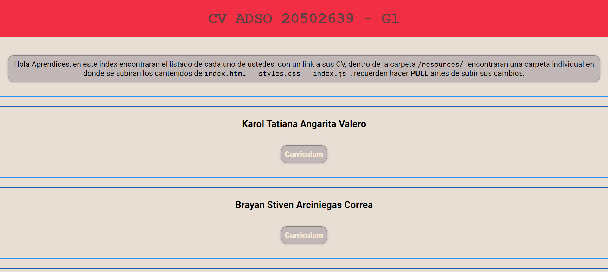

 

  

  <h3 align="center">ADSO2502639G1</h3>

  

    ADSO 2502639G1 - Repository Test
     
     
    <a href="https://github.com/hdtoledo/ADSO2502639G1"><strong>Explore the docs »</strong></a>
     
     
    <a href="https://github.com/hdtoledo/ADSO2502639G1">View Demo</a>
    .
    <a href="https://github.com/hdtoledo/ADSO2502639G1/issues">Report Bug</a>
    .
    <a href="https://github.com/hdtoledo/ADSO2502639G1/issues">Request Feature</a>
  

      

## About The Project

En este proyecto de prueba, los aprendices del ADSO 2502639 - G1, desarrollaran actividades de aprendizaje para manejar los diferentes temas y conceptos de HTML5, CSS, JS y GIT.

## Built With

Comming

## Getting Started

Comming

### Prerequisites

Comming

### Installation

Comming

## Usage

En este espacio se subiran las diferentes actividades de aprendizaje.

## Roadmap

Comming

## Contributing

Contributions are what make the open source community such an amazing place to be learn, inspire, and create. Any contributions you make are **greatly appreciated**.
* If you have suggestions for adding or removing projects, feel free to [open an issue](https://github.com/hdtoledo/ADSO2502639G1/issues/new) to discuss it, or directly create a pull request after you edit the *README.md* file with necessary changes.
* Please make sure you check your spelling and grammar.
* Create individual PR for each suggestion.
* Please also read through the [Code Of Conduct](https://github.com/hdtoledo/ADSO2502639G1/blob/main/CODE_OF_CONDUCT.md) before posting your first idea as well.

### Creating A Pull Request

1. Fork the Project
2. Create your Feature Branch (`git checkout -b feature/AmazingFeature`)
3. Commit your Changes (`git commit -m 'Add some AmazingFeature'`)
4. Push to the Branch (`git push origin feature/AmazingFeature`)
5. Open a Pull Request

## Authors

* **@hdtoledo** - *Instructor* - [@hdtoledo](https://github.com/hdtoledo/) - **

## Acknowledgements

* [hdtoledo](https://github.com/hdtoledo/)
